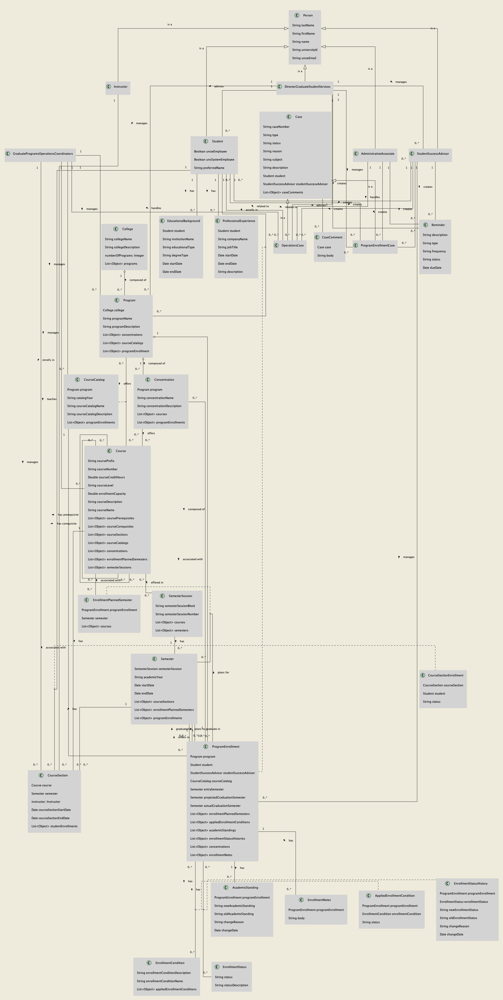
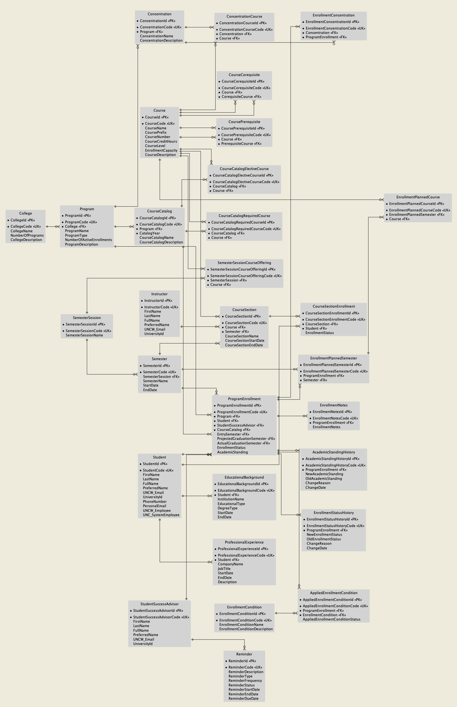
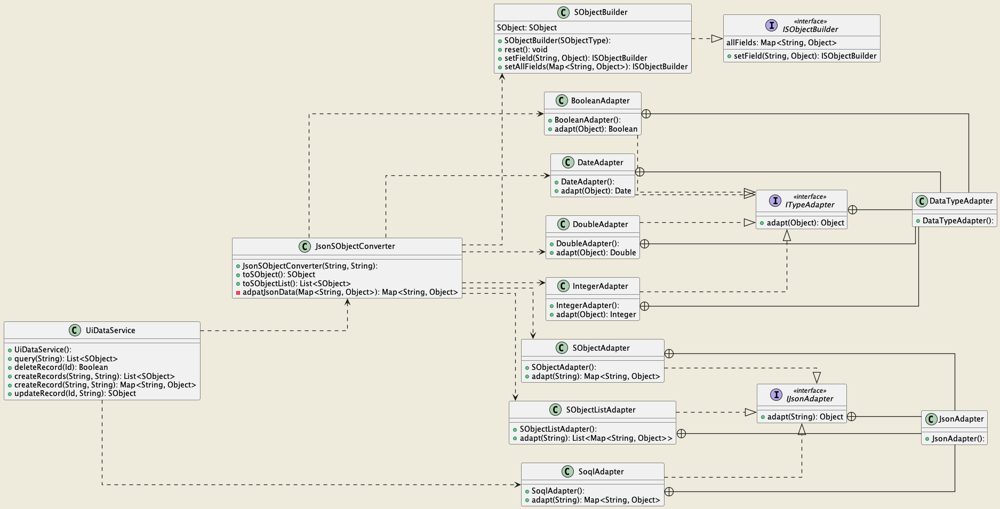
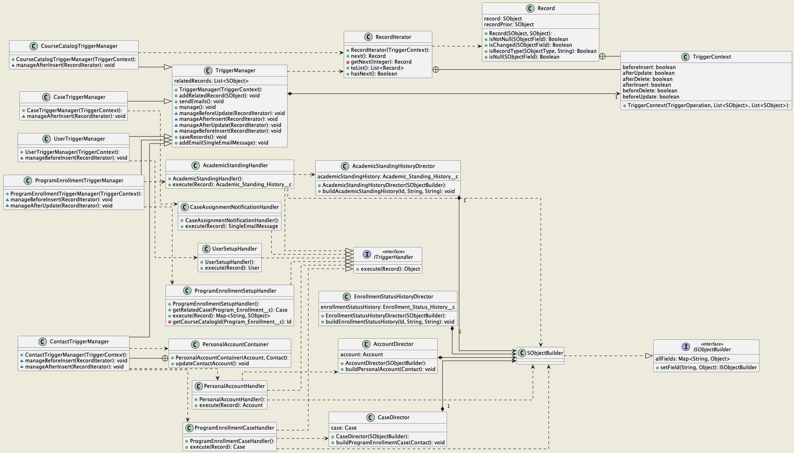

# OAP Operations and Advising System
The OAP Operations and Advising System is a comprehensive system designed to streamline and enhance the operations and advising processes of the OAP (Operations and Advising Programs) programs. It provides a centralized platform for managing student data, program enrollments, academic standing, and related activities.

## Features
* Program Enrollments: The system enables the management of program enrollments, including the creation, update, and deletion of program enrollment records. It tracks essential information such as student details, program information, enrollment status, and academic standing.
* Operations and Advising Processes: The system facilitates various operations and advising processes, including automatic case generation for program enrollments, email notifications for case assignments, and updates to academic standing history.
* Data Conversion: The system includes a JSON-to-SObject conversion module, which converts JSON data into Salesforce SObjects. This feature simplifies the process of importing external data into the system.
* Trigger Management: The system employs trigger managers to handle trigger logic for different objects. Trigger managers follow a standard structure and utilize specific trigger handlers to execute customized logic for each trigger event.

## System Architecture
* The OAP Operations and Advising System is built on the Salesforce Lightning Platform, utilizing a microservices architecture. The system architecture consists of several key components:
* System Design: The system design stage focuses on creating a comprehensive blueprint for implementing the OAP Operations and Advising System. It includes system architecture, cloud computing, Salesforce infrastructure, and component decomposition, ensuring a flexible, scalable, and maintainable system foundation.
* Design Patterns: The project incorporates various design patterns, including the Facade pattern, Adapter pattern, Template Method pattern, Command pattern, and Builder pattern. These patterns enhance the codebase's organization, modularity, and extensibility, promoting maintainability and flexibility.
* Data Management: The system leverages Salesforce's robust data management capabilities, utilizing Salesforce Objects (SObjects) for storing and managing data. SOQL and SOSL queries are employed for data retrieval, and Apex triggers and classes handle data manipulation and business logic.
* User Interface: The system's user interface is built using Lightning Web Components (LWC) and follows the guidelines and patterns of the Lightning Design System. LWC provides a modern, responsive interface, ensuring an intuitive and consistent user experience.

## System Design
### Entity Relationship Diagram

The entity-relationship diagram (ERD) showcases the relationships between entities in the OAP Operations and Advising System. It visualizes how different entities, such as Program Enrollment, Student, Case, and Academic Standing, are connected and the attributes associated with each entity.

### Domain Class Diagram

The domain class diagram illustrates the classes and their relationships in the OAP Operations and Advising System. It represents various entities and concepts in the domain, such as Program Enrollment, Student, Academic Standing, Case, and more. The diagram includes the attributes associated with each class, providing a comprehensive view of the system's data model.

### Service Diagram

The service diagram provides an overview of the system's service layer architecture. It demonstrates the interactions between different services within the OAP Operations and Advising System. The diagram shows how services like Program Enrollment Service, Case Service, and Academic Standing Service communicate with each other to perform operations and fulfill the system's functionality.

### Trigger Diagram

The trigger diagram illustrates the trigger logic and its relationship with other components in the OAP Operations and Advising System. It visualizes how triggers, such as Program Enrollment Trigger and Academic Standing Trigger, interact with the Trigger Manager and Trigger Handler components. The diagram showcases the flow of trigger events and the execution of trigger logic in the system.